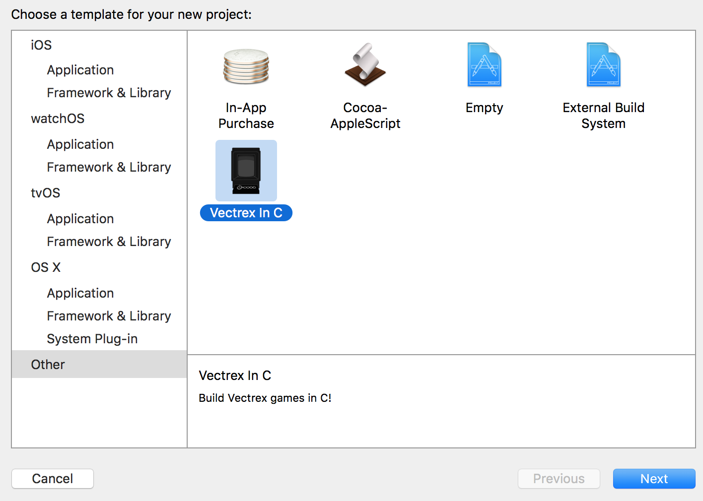

# Vec-C 
Program Vectrex games in C using Xcode for Mac OS X.

Vec-C is an Xcode template that allows you to write a game for Vectrex on Mac. An installer will be provided soon to put in place all the various dependencies (assembler, linker, compiler etc). Included is a build script that automatically runs on build inside xcode and goes on to open the final .bin file in ParaJVE (a Vectrex emulator for Mac).

An installer will be created shortly; until then copy all '.bin' files from the dependencies folders to /usr/local/bin.

Manually copy the xcode template to the following location on you Mac (inside Xcode.app):

/Applications/Xcode.app/Contents/Developer/Library/Xcode/Templates/Project\ Templates/Base/Other/Vectrex\ In\ C.xctemplate
